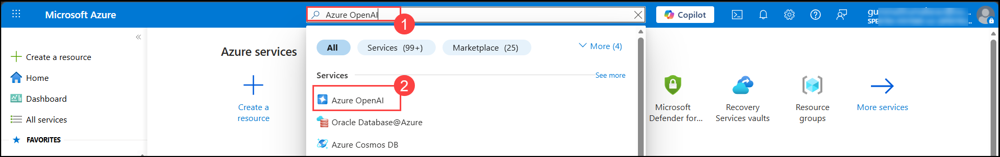
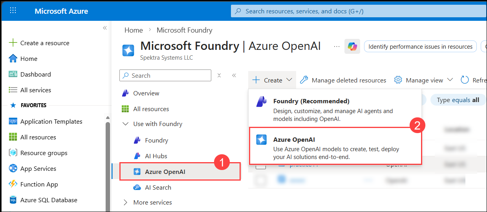
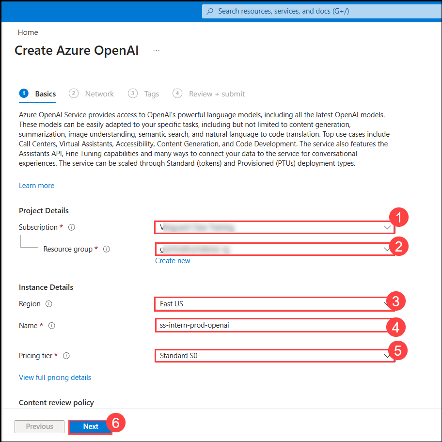
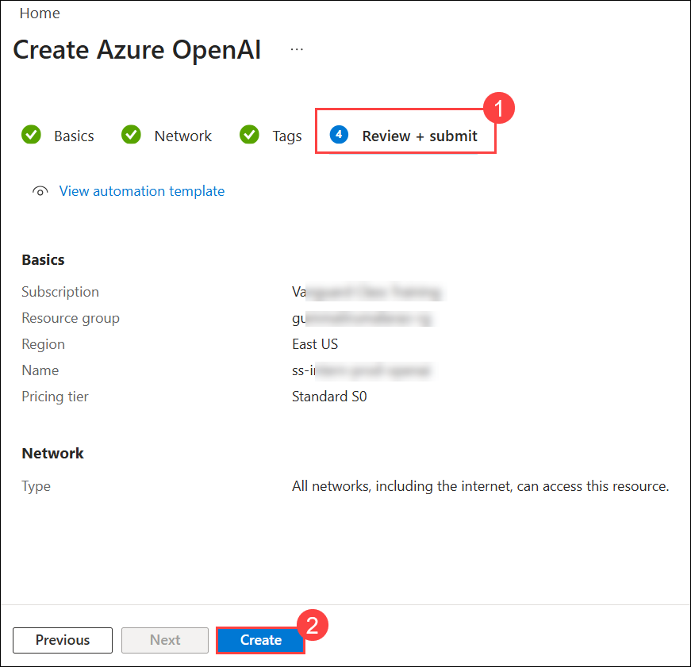
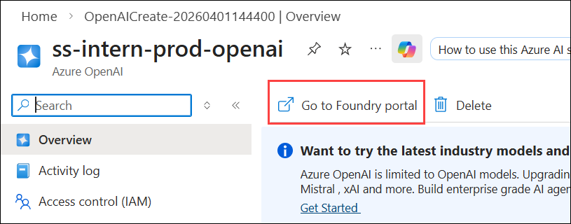
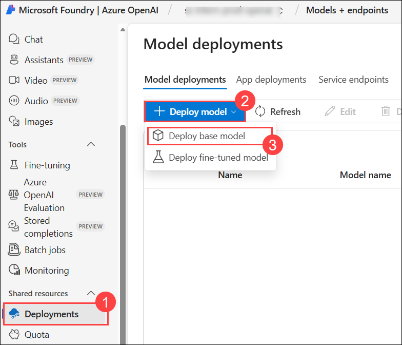
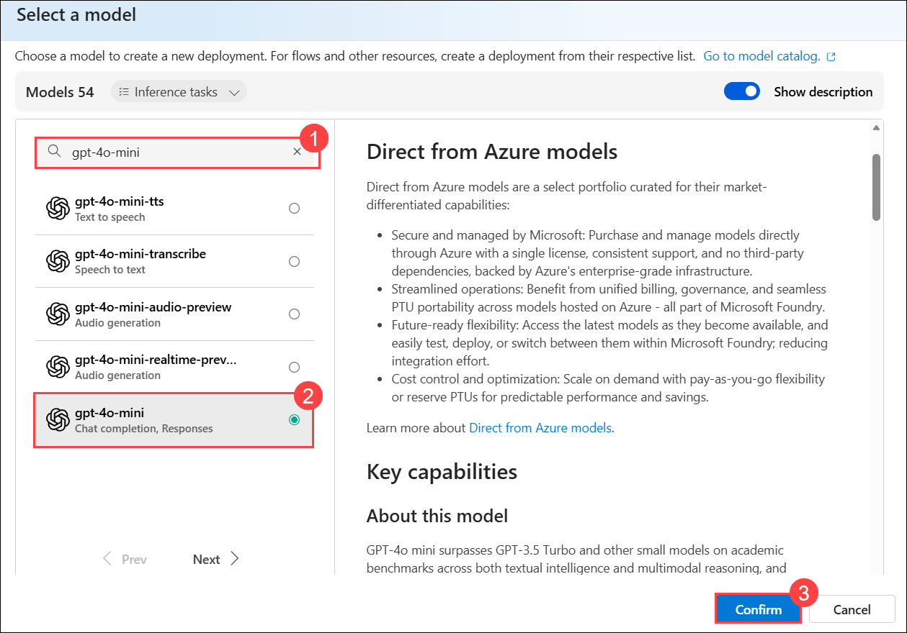
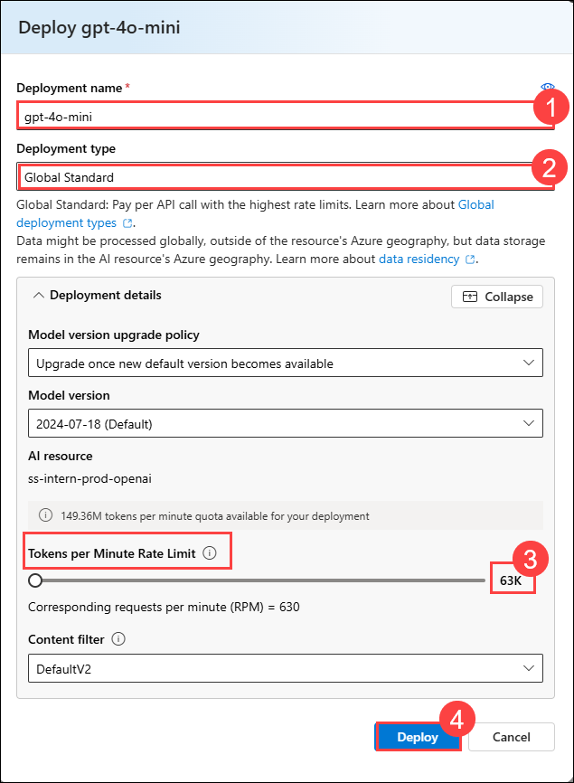
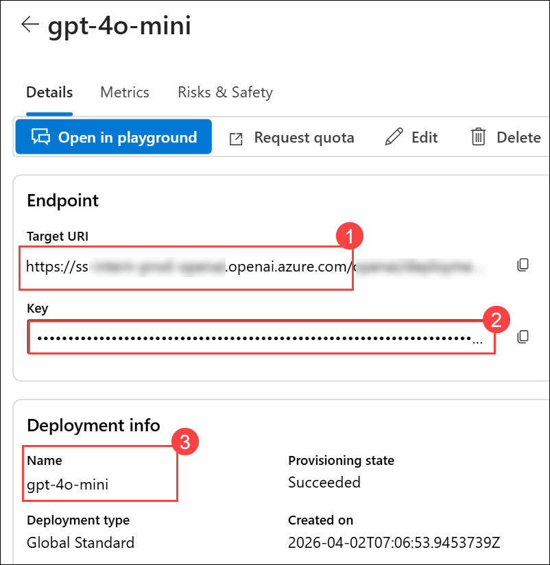

# Get started with Azure OpenAI Service

Azure OpenAI Service brings the generative AI models developed by OpenAI to the Azure platform, enabling you to develop powerful AI solutions that benefit from the security, scalability, and integration of services provided by the Azure cloud platform. In this exercise, you'll learn how to get started with Azure OpenAI by provisioning the service as an Azure resource and using Azure OpenAI Studio to deploy and explore OpenAI models.

This exercise takes approximately **30** minutes.

## Before you start

You'll need an Azure subscription that has been approved for access to the Azure OpenAI service.

- To sign up for a free Azure subscription, visit [https://azure.microsoft.com/free](https://azure.microsoft.com/free).
- To request access to the Azure OpenAI service, visit [https://aka.ms/oaiapply](https://aka.ms/oaiapply).

## Provision an Azure OpenAI resource

Before you can use Azure OpenAI models, you must provision an Azure OpenAI resource in your Azure subscription.

1. Sign into the [Azure portal](https://portal.azure.com).
1. Navigate to Search bar on Azure Portal. Type **Azure OpenAI (1)** and Select the **Azure OpenAI (2)** service.

   

1. It takes you to the Microsoft foundary| Azure OpenAI page. 

   

1. Create an **Azure OpenAI** resource with the following settings:
    - **Subscription (1)**: An Azure subscription that has been approved for access to the Azure OpenAI service.
    - **Resource group (2)**: Create a new resource group with a name of your choice.
    - **Region (3)**: Choose any available region.
    - **Name (4)**: A unique name of your choice.
    - **Pricing tier (5)**: Standard S0
    - Click on  **Next (6)**

    

1. Click Next until you reach the **Review + create (1)** tab and click **create (2)** button. 

    

1. Wait for deployment to complete. Then Click on **Go to resource**. 

1. After creating the Azure OpenAI resource, navigate to the Overview page and click on **“Go to Foundry Portal”** to access and manage your models.

    

1. You will land on Microsoft Foundry portal overview page. On the left-pane navigation under shared resources select **Deployments (1)**. Click on **+ Deploy model (2)** dropdown, select **Deploy base model (3)**

    

1. It show a popup-page to Select a model. Use search bar and type **gpt-4o-mini (1)** and select the **gpt-4o-mini (2)** and click  **Confirm (3)**.

    

1. When the deployment pop-up for gpt-4o-mini appears, click on Customize and set a custom **deployment name (1)** or use the default, which is the model name **(gpt-4o-mini)**.
 - Deployment type - **Global Standard (2)** 
 -  Tokens per Minute (TPM) -  **50K–70K range(3)**, then proceed with **deploy (4)**.

    

1. Navigate to the deployed model, then copy the Endpoint **Target URI (1)** and **API Key (2)** and **deployment name (3)** under Deployment info section for use in API integration.

> Note: Endpoint URI/Target URI (Syntax) - https://openai-project-name.openai.azure.com/

    